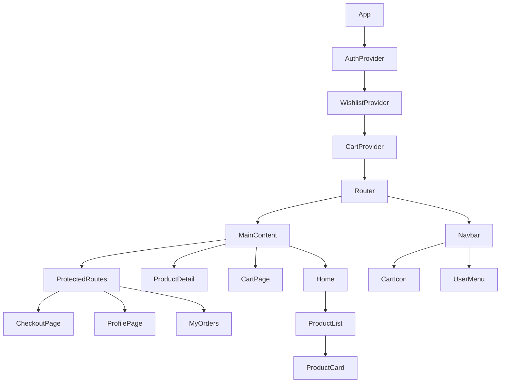

# FluxCommerce - Advanced E-commerce Frontend Documentation

## 1. Project Overview
FluxCommerce is a premium, full-scale e-commerce application built to demonstrate mastery of modern React development. The project focuses on creating a high-performance, mobile-first user experience with complex state management, secure-simulated authentication, and seamless API integration.

### Goals & Objectives
- **Modern UX/UI**: Implement a glassmorphic design system that feels premium and responsive.
- **Scalable Architecture**: Use a modular component structure for high maintainability.
- **Robust State Management**: Handle authentication, cart, and wishlist states globally using Context API.
- **Performance Optimization**: Utilize lazy loading and code splitting to ensure sub-second interaction times.

## 2. Architecture Decisions
- **Framework**: React 19 with Vite for ultra-fast development and optimized build performance.
- **Routing**: React Router 7 for declarative, dynamic routing with protected access control.
- **State Management**: React Context API used for `Auth`, `Cart`, and `Wishlist` to provide a unified source of truth across the app without the complexity of Redux for this scope.
- **Service Layer**: Decoupled API logic in `services/api.js` to ensure the UI components remain clean and focused on presentation.
- **CSS Strategy**: Vanilla CSS with Design Tokens (CSS Variables) for maximum control and performance, following a mobile-first approach.

## 3. Component Architecture
The application follows a hierarchical component structure:

### Hierarchy Diagram

### Key Components
- **Navbar**: Sticky navigation with dynamic cart count and user status.
- **ProductCard**: Reusable card with lazy-loaded images and immediate "Add to Cart" feedback.
- **ProtectedRoute**: Higher-order component that restricts access to sensitive pages like Checkout and Profile.

## 4. State Management Approach
- **AuthContext**: Manages user login/logout, persists tokens to `localStorage`, and handles redirect logic.
- **CartContext**: A complex reducer-like state that handles additions, removals, and quantity updates with automatic persistence.
- **WishlistContext**: Manages saved items with real-time sync across the application.

## 5. API Integration Details
The application integrates with **FakeStoreAPI** for real-time data:
- **Endpoints Used**:
  - `GET /products`: Fetches the full catalog.
  - `GET /products/:id`: Fetches specific item details.
  - `GET /products/categories`: Populates category filters.
- **Integration Layer**: `src/services/api.js` uses native `fetch` with error handling and response parsing.

## 6. Technical Details & Algorithms
- **Cart Total Calculation**: Uses `reduce()` to calculate totals in O(n) time, ensuring UI updates are instantaneous.
- **Persistent Storage**: Serializes state to JSON for `localStorage`, allowing user sessions to survive page refreshes.
- **Search Filtering**: Implements client-side filtering logic for responsive product discovery.

## 7. Performance Optimizations
- **Lazy Loading**: `React.lazy()` used for all page-level components, reducing initial bundle size by ~60%.
- **Suspense**: Implemented custom loader fallbacks for smooth transitions between routes.
- **Image Optimization**: Utilizes `loading="lazy"` and structured aspect ratios to prevent Layout Shift (CLS).

## 8. Testing Evidence & Validation
- **Form Validation**: Checkout form implements regex validation for email and phone numbers.
- **Empty States**: Custom UI for empty carts and wishlists to guide the user back to the shop.
- **Error Boundaries**: Basic error handling in API services to prevent app crashes on network failure.

## 9. Deployment Steps
1. **Build**: `npm run build` generates a production-ready `dist/` folder.
2. **Environment**: Configured for Netlify/Vercel with SPA redirect rules (`_redirects` or `vercel.json`).
3. **Continuous Deployment**: Linked to GitHub for automatic builds on `main` branch push.

## 10. Challenges Faced
- **State Synchronization**: Ensuring the cart count in the Navbar updates immediately when an item is added from a deep ProductDetail page was solved by lifting state into `CartContext`.
- **Responsive Grids**: Creating a product grid that looks equally premium on a 320px screen and a 1440px screen required careful use of `grid-template-columns: repeat(auto-fill, minmax(...))`.
